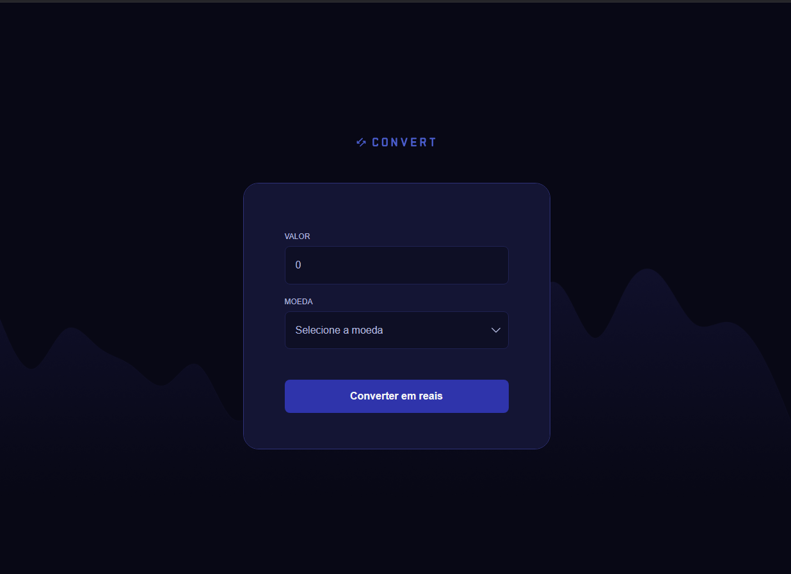

# Conversor de Moedas

Este é um projeto de conversor de moedas simples, desenvolvido como parte do curso FullStack da Rocketseat. O projeto permite converter valores em Reais (BRL) para diferentes moedas estrangeiras (Euro, Dólar e Libra) de forma intuitiva e eficiente.




## Funcionalidades

- **Conversão de moedas**: Insira um valor em Reais e escolha a moeda desejada para conversão (Euro, Dólar ou Libra).
- **Interface intuitiva**: Design simples e moderno que facilita o uso.

## Tecnologias Utilizadas

- **HTML**: Estrutura do projeto.
- **CSS**: Estilização e design responsivo.
- **JavaScript**: Lógica de conversão e manipulação do DOM.

## Métodos e Funcionalidades do Código

No JavaScript foram utilizados os seguintes métodos e funcionalidades:

### Manipulação de DOM

1. `document.querySelector` e `document.getElementById`:
   - Utilizados para capturar elementos do HTML pelo seletor CSS ou pelo ID.

2. `textContent`:
   - Define ou altera o texto de um elemento.

3. `classList.add` e `classList.remove`:
   - Adiciona ou remove classes de um elemento para manipular estilos dinamicamente.

### Eventos

4. `addEventListener("input", callback)`:
   - Adicionado ao campo de input para monitorar alterações no valor digitado.

5. `onsubmit`:
   - Usado no formulário para capturar o evento de envio e evitar o comportamento padrão.

### Expressões Regulares

6. `/\D+/g`:
   - Expressão regular utilizada para remover caracteres não numéricos no campo de entrada.

### Manipulação de Números

7. `Number(value).toLocaleString("pt-BR", { style: "currency", currency: "BRL" })`:
   - Formata um valor numérico para o padrão de moeda brasileira (BRL).

## Como Usar

1. Clone este repositório:
   ```bash
   git clone https://github.com/seu-usuario/seu-repositorio.git
   ```

2. Abra o arquivo `index.html` em seu navegador.

3. Insira o valor em Reais no campo de entrada.

4. Selecione a moeda desejada no menu suspenso.

5. Clique no botão "Converter em reais" para ver o resultado.

## Melhorias Futuras

- Implementação de uma API para obter cotações de moedas em tempo real.
- Adição de novas moedas para conversão.
- Melhorias na acessibilidade do design.

## Autor

Desenvolvido por **Osvaldo Alves**. Se tiver dúvidas ou sugestões, entre em contato:

- [LinkedIn](https://linkedin.com/in/seu-usuario)
- E-mail: osvaldofabarboza@gmail.com
- WhatsApp: (11) 94528-1950

## Contribuição

Contribuições são sempre bem-vindas! Fique à vontade para abrir uma *issue* ou enviar um *pull request*.

## Licença

Este projeto é de uso livre e não possui licença específica.
